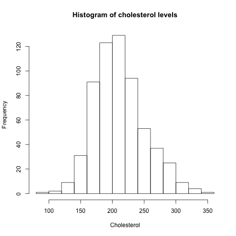

```{r setup, include=FALSE}
knitr::opts_chunk$set(echo = TRUE)
```

Create a project folder called `project1` on your computer. You will
put all your Project 1 files in this folder.

Go to my GitHub site at <https://github.com/taragonmd/data>.

Go into the `project1` folder.

Download this Rmarkdown template (`PH251D2018_LastName_Project1.Rmd`)
and edit.  Use R Markdown to demonstrate the following skills:

## 1. Using the `source` function

Download the `problem1.R` file and save to the `project1` folder. Run
the program file (problem1.r) using the ‘source’ command. Show the R
code chunk and results below.

```{r}
source('problem1.R')
```

## 2. Read an ASCII data set

The Evans data set (`evans.txt`) is here: <https://github.com/taragonmd/data>.

Alternatively, here is the raw Evans data set: <https://raw.githubusercontent.com/taragonmd/data/master/evans.txt>.

Demonstrate reading the Evans data file (evans.txt) to create a data
frame, and use the `str` function to explore the structure of the data
set. Show the R code chunk and results below.

```{r}
edat <- read.table('https://raw.githubusercontent.com/taragonmd/data/master/evans.txt',
sep='', header=TRUE)
str(edat)
```

## 3. Discretizing a continuous variable into a categorical variable

Total cholesterol levels less than 200 milligrams per deciliter
(mg/dL) are considered desirable (**normal**) for adults. A reading
between 200 and 239 mg/dL is considered **borderline high** and a
reading of 240 mg/dL and above is considered **high**.[^1]

The Evan data dictionary is in Appendix D of the PHDSwR book.
Convert total cholesterol variable (`chl`) into a categorical
variable (factor) with the three levels described above.


[^1]: Source: https://www.medicalnewstoday.com/articles/315900.php

```{r}
edat$cholcat <- cut(edat$chl, breaks=c(0,200,240,400),right=FALSE)
table(edat$cholcat)
```

## 4. Working with dates and times

President John F. Kennedy was assassinated on "November 22,
1963". Convert this character string into a R date object. Show how to
use R to display (a) the Julian date; (b) the day of the week, and (c)
the week of the year.


```{r}
jfk <- as.Date('November 22, 1963', format = '%B %d, %Y')
julian(jfk)
weekdays(jfk)
format(jfk, format='%U') # week of the year (00-53) Sun
format(jfk, format='%V') # week of the year (01-53) Mon
format(jfk, format='%W') # week of the year (00-53) Mon
```

## 5. Simple two-way analysis

Create a simple 2x2 table of smoking (`smk`) and coronary heart
disease (`chd`). Use the `fisher.test` on this 2x2 table and describe
your findings.

```{r}
(tab <- xtabs(~smk + chd, data = edat))
fisher.test(tab)
```

## 6. Write your own function

Now, write a function to calculate the odds ratio of your 2x2 table
above. 


```{r}
riskOR <- function(x){
  risk1.odds <- x[2,2]/x[2,1]
  risk0.odds <- x[1,2]/x[1,1]
  return(risk1.odds/risk0.odds)
}
riskOR(tab)
```

## 7. Nested `for` loops

Write a nested `for` loops to create a mulitiplication table for the
numbers 1 to 10.

```{r}
x <- 1:10
mtab <- matrix(NA, 10, 10)
for(i in x){
  for(j in x){
    mtab[i, j] <- x[i] * x[j]
  }
}
mtab
```

## 8. Create a simple graph

From the Evans data create a histogram of the total cholesterol (`chl`).
Label with a title and axis labels. Output to a PNG file using the
`png` function.

```{r}
png(file = "myplot.png")
  hist(edat$chl, xlab='Cholesterol', main='Histogram of cholesterol levels')
dev.off()
```

## 9. Display PNG file in your Rmarkdown document

Using Rmarkdown syntax, display the PNG you created above.

```{r, out.width='80%', fig.align='center'}
library(knitr)

```

## 10. Using regular expressions

Here are the California counties: <https://github.com/taragonmd/data/blob/master/calcounty.txt>

Remove the "California" entry.

Use regular expressions to identify and display the County names that
start with two or three letters followed by a space (e.g., `"San "`).

```{r}
cac <-
scan('https://raw.githubusercontent.com/taragonmd/data/master/calcounty.txt',
what="")
cac <- cac[cac!="California"]
grep("^[[:alpha:]][[:alpha:]].?[[:space:]]", cac, value = TRUE)
```
